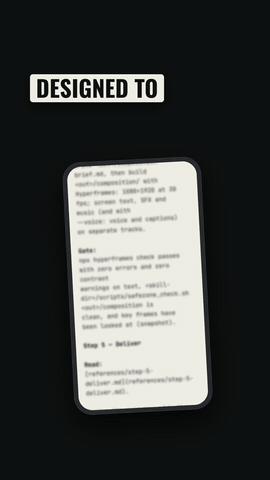

# /thumbstop

**Stop the scroll.** `/thumbstop` is an agent skill that turns the project
you're working on into a short vertical video for TikTok, Instagram Reels and
Facebook Reels: a hook in the first second, the project's own words and
visuals, and exports ready to post. One command.

The name comes from the *thumb-stop*: the moment a scrolling thumb stops on a
video. Thumbstop is designed to stop your thumb.

<p align="center">
  <a href="docs/media/thumbstop-stop-your-thumb.mp4"></a>
</p>
<p align="center"><sub><b>Made with /thumbstop</b> (no voice)<br />Click the video to watch it with sound.</sub></p>

**The first video was made with this skill.** `/thumbstop`, run on this
repo, read its own README and rules, wrote three hooks, checked every claim
against these files (the truth check you see in it is that run's real result)
and rendered the video. No camera, no editing app.

## Install

**Claude Code** (as a plugin):

```bash
/plugin marketplace add pegerfalk/thumbstop
/plugin install thumbstop@thumbstop
```

Then run `/thumbstop` inside any project.

**Any other agent**: one command via the [`skills`](https://github.com/vercel-labs/skills)
CLI (Cursor, Codex, Copilot, Gemini CLI, opencode and more):

```bash
npx skills add https://github.com/pegerfalk/thumbstop --skill thumbstop
```

Add `-g` to install it globally (every project); leave it out to scope it to
the current one.

<details>
<summary>No installer? Copy the skill directly.</summary>

```bash
rsync -a --exclude '.DS_Store' skills/thumbstop/ ~/.claude/skills/thumbstop/
```

Restart your agent after copying.
</details>

### Also works with

This repo exposes the skill at each agent's standard discovery path through
symlinks, so a clone works without extra setup.

| Agent | How it finds the skill |
|---|---|
| **Claude Code** | `.claude/skills/thumbstop/` (besides the plugin install above) |
| **Codex CLI** | `.agents/skills/thumbstop/`, walking up to the repo root |
| **Google Antigravity** | `.agents/skills/thumbstop/` at the project root, or `~/.gemini/config/skills/thumbstop/` globally |
| **opencode** | `.opencode/skills/thumbstop/` |
| **Other agents** | Point the agent's custom instructions at `skills/thumbstop/SKILL.md` |

> **Windows:** git needs `git config core.symlinks true` (or
> `git clone -c core.symlinks=true`) and Developer Mode or admin rights to
> create symlinks. If they don't work, copy `skills/thumbstop/` into the
> agent's skill folder instead.

## Use it

From any project directory:

```text
/thumbstop
```

With no brief, it picks the angle itself. Or steer it:

```text
/thumbstop what makes the export feature different
/thumbstop --format listicle three things people get wrong about X
/thumbstop --voice                 # add a voiceover (af_heart) with captions
/thumbstop --voice am_michael --captions pill
```

Without `--voice` the video has no voice: the on-screen text and the pictures
carry it, so every line is written to stop the scroll on its own.

A run has no stops by default, except the first run in a project: it stops
once after the script to show the hooks and the material it plans to use, and
remembers your answers for next time (`--no-review` skips it). Add `--review`
to choose the hook and approve the script on any run, or `--preview` to watch
it in Hyperframes Studio before it renders.

You get a `thumbstop-output/<date>-<slug>/` folder:

| File | What |
|---|---|
| `<slug>-nomusic.mp4` | Sound effects (+ voice with `--voice`); add trending audio in the app |
| `<slug>-music.mp4` | The same + a music bed (when a track is available) |
| `cover.jpg` | The cover, also baked in as frame 0 so every auto-thumbnail is right |
| `tiktok.txt` · `instagram.txt` · `facebook.txt` | Post text + an upload checklist (disclosures, AI label when voiced, hashtag limits) |
| `profile.md` | What it learned about your project; reused on the next run |
| `thumbstop-plan.md` | Hooks, script, storyboard, timing, and a source for every claim |

## Launching or posting?

[`/brag`](https://github.com/latent-spaces/brag) makes a landscape launch
video of the thing you built: use it for the launch. `/thumbstop` makes the
vertical videos for the feed after that: one idea per video, built to stop
the scroll, with the cover and post texts ready to upload.

## What it does for you

- **Hook first.** Three hooks, scored; the first second carries an image, the
  hook line and a sound.
- **True claims only.** Every number and claim in the script traces to a file
  in your project, or it is cut.
- **Never a still frame.** Without a voice, lines build phrase by phrase on
  the music's beat, key words get a marker a beat later, and something moves
  about every second beat. Every line still stays up long enough to read.
- **A voice with punch** (`--voice`). Kokoro's `af_heart` at a brisk pace,
  pauses tightened, compressed and loudness-matched for phones; captions in
  the script's spelling on the voice's timing, one to three words per group,
  active word highlighted, contrast-checked.
- **Platform-safe.** All text stays out of the TikTok, Instagram and Facebook
  UI zones (a common safe box, verified against the platforms' own specs and
  enforced by an automated check).
- **Real product on screen.** Your own footage when you have it, otherwise the
  product rebuilt from its source, the way `/brag` does it.

## Requirements

- An agent that supports Agent Skills (see "Also works with" above)
- Node.js 22+ and the Hyperframes CLI (`npx hyperframes`; check with
  `npx hyperframes doctor`)
- FFmpeg on `PATH`
- Python 3 (standard library only)

With `--voice`, Kokoro and whisper models are downloaded by Hyperframes on
first use.

## Music

The skill does not ship music files. For the `-music` export, pass
`--music <file>`, or download the recommended free tracks once (CC BY 4.0,
credit optional; links in
[`skills/thumbstop/references/audio.md`](skills/thumbstop/references/audio.md))
into `~/.cache/thumbstop/music/`. Without a track you get the `-nomusic`
export, ready for a trending sound added in the app.

## What's in this repo

- `skills/thumbstop/`: the skill, its references, scripts, sound effects and
  music cue presets
- `agents/truth-checker.md`: a read-only subagent that checks every claim in
  a plan against the project's sources before anything is built
- `docs/`: the launch site and the demo videos
- `.claude-plugin/`: plugin manifest and marketplace catalogue
- `.claude/skills/`, `.agents/skills/`, `.opencode/skills/`: symlinks to
  `skills/thumbstop/` for agent discovery

## Credits

- Forked from [`/brag`](https://github.com/latent-spaces/brag) by Shunit Haviv Hakimi (MIT)
- Video engine: [Hyperframes](https://hyperframes.heygen.com/)
- Voice: Kokoro-82M, through Hyperframes
- Sound effects: [Kenney](https://kenney.nl/) and unicaegames (CC0)
- Music in the demo video: Happy Beats & Business Moves Vol. 10
  by Sascha Ende, [ende.app](https://ende.app/en) (CC BY 4.0)

## Contributing

Ideas, bug reports and videos you made with it are welcome: open an issue or a
pull request. If a video came out wrong, attach its `thumbstop-plan.md`; it
says why each choice was made.

## Licence

MIT, see [LICENSE](LICENSE). Bundled sound effects are CC0; see
[`skills/thumbstop/LICENSE`](skills/thumbstop/LICENSE).
